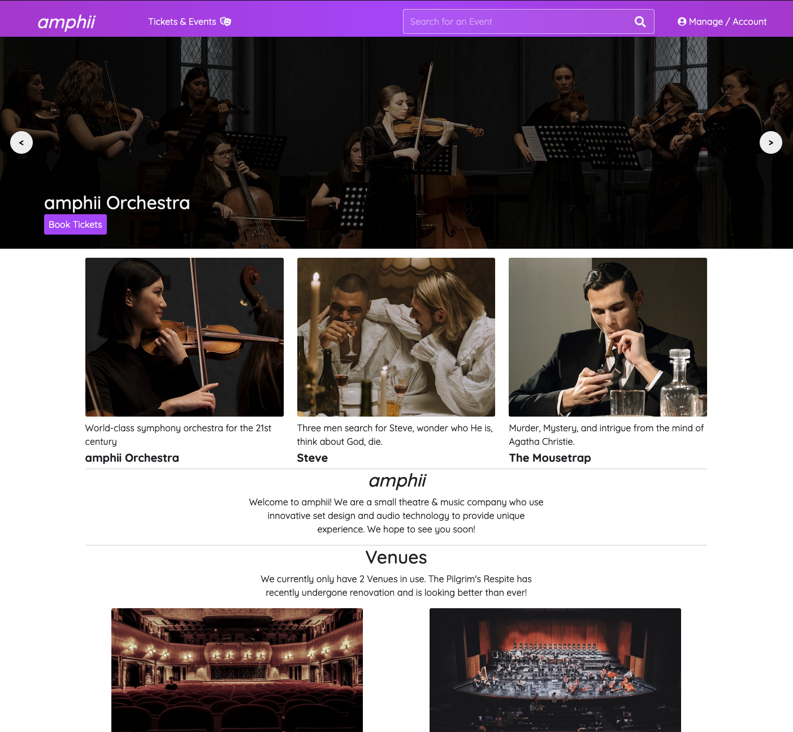
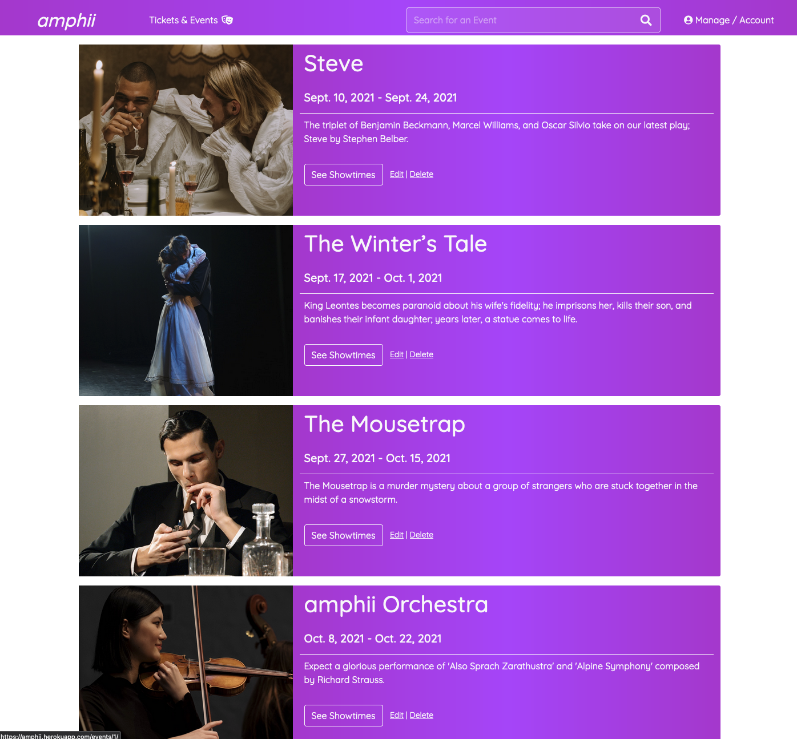
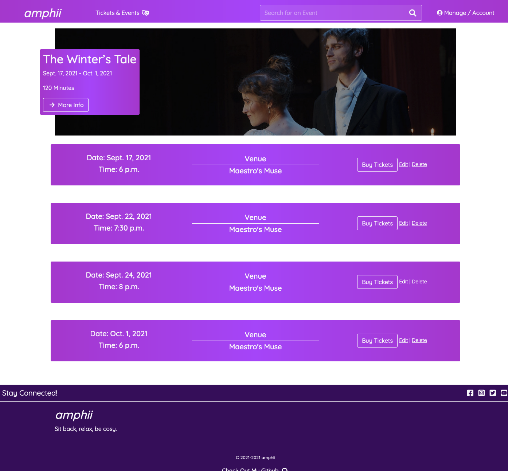
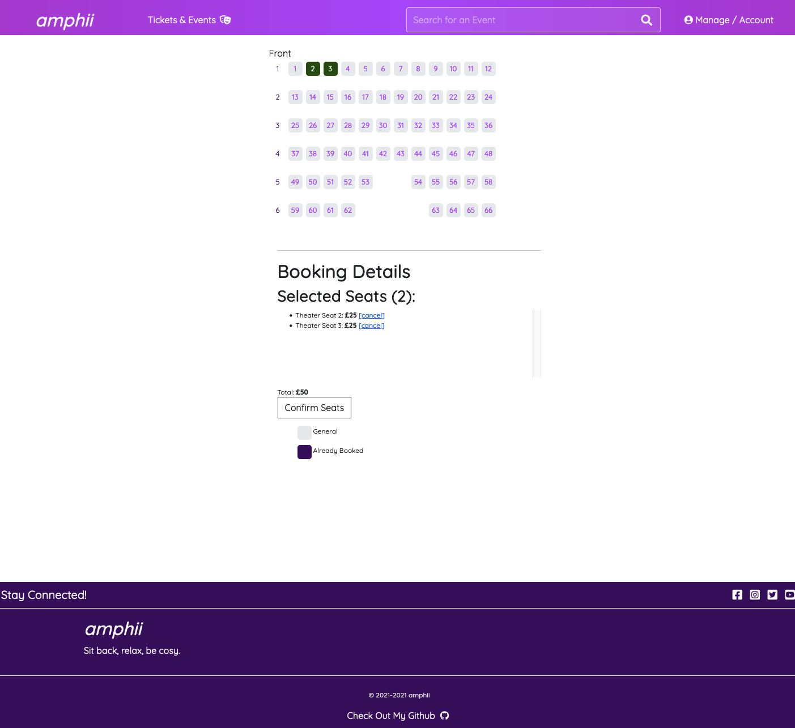
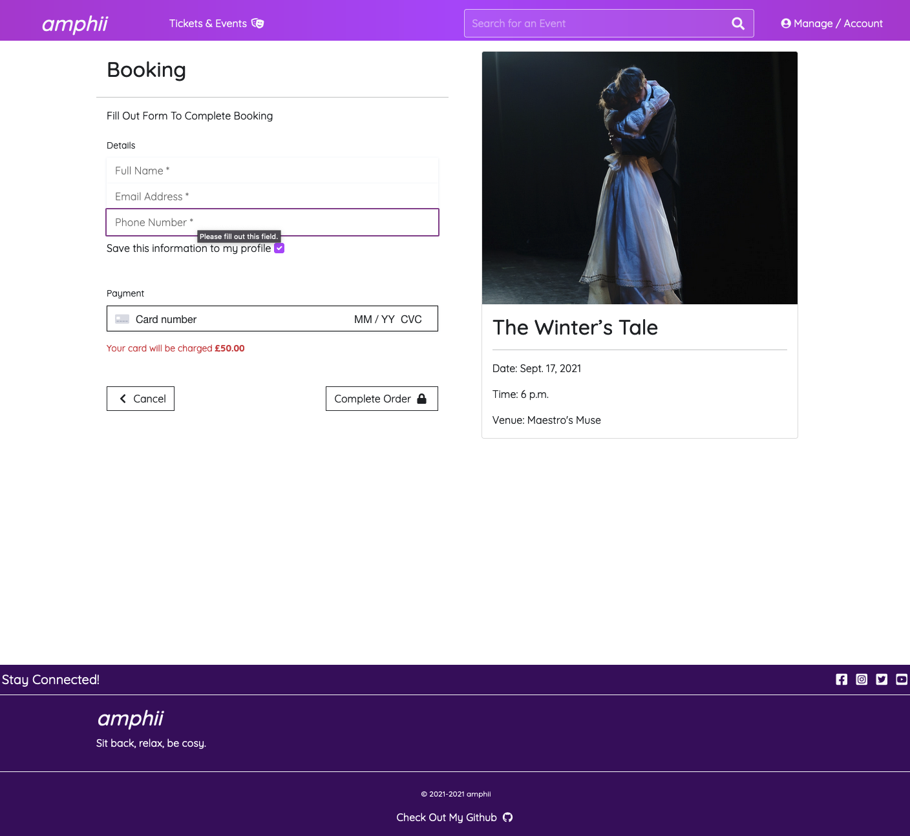
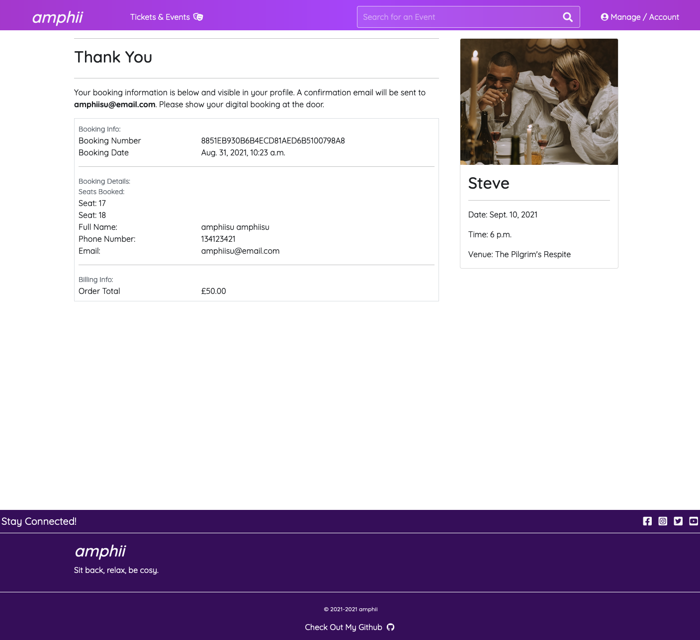
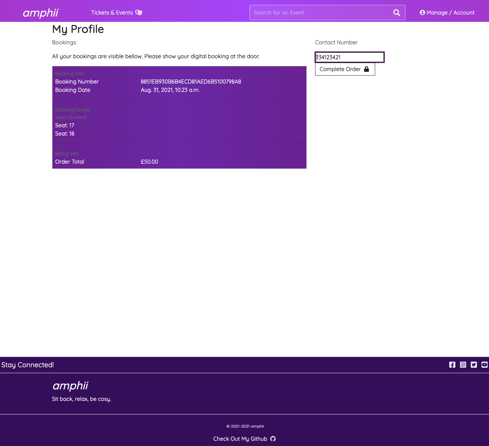
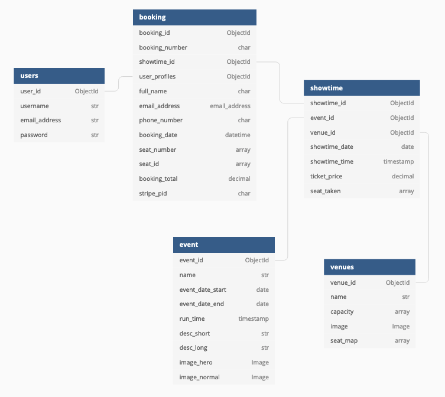

Code Institute Project 4

For MS4 I have created a website for 'amphii' the mock theatre company. The website is built with Python, Django, JavaScript, CSS, Bootstrap and HTML. It uses a PostgreSQL relational database, Stripe payment and is designed to be responsive across multiple devices although the primary focus was on desktop. amphii allows users to book tickets to attend a variety of different events by selecting seats from a seat chart.

# MS4: View Live Project [Here](https://amphii.herokuapp.com/)

## User Experience

### Features

- Carousel for homepage to see some current events.
- Pages to display events and their respective showtimes.
- jQuery Seat Chart: Select from seats available during booking process.
- Pay for tickets using Stripe.
- View tickets from the users personal account.
- Allauth user accounts.
- Admin event and showtime CRUD.

### User Stories

As a first time user, I want:
- To quickly be able to understand the purpose of the website and how I can start interacting with it.
- To be able to register, sign in and sign out with ease.
- To navigate through the site intuitively finding potential events to attend.

As a returning visitor, I want:
- To sign in as easily as I did on my first visit and remain signed in.
- To be able to reset my password in the event that I forgot it.
- To be able to book seats to a certain event by choosing my seats by way of the seat chart.
- To be able to view all my bookings from my profile.
- To be able to save my details for future purchases.

As a frequent user, I want:
- To sign in and view my bookings.
- To continue booking events.
- To change some of my creditials used during the booking process.

### User Journey

1. User's Journey starts at the homepage. 
1. They are presented with a carousel of the 3 most recently created shows.
1. Underneath this carousel are 3 clickable images with a more intimate picture of the same shows inviting the user in.
1. Clicking on many of these buttons leads to the Showtimes page or if using the navbar, they are lead to the events page.

1. The Event Page features all the events currently on show at amphii which can be filtered using the search bar.
1. The user can click on the buttons to lead themselves to the respective showtime page for that event.

1. The showtime page will prompt the user to create an account.
1. This is required to use the website as tickets are stored in the users account page.
1. However, if they are already signed in, the user can click on a showtime they can attend and start booking seats.

1. They are presented with the seat chart. This is much like a cinema booking system where the user can choose seats.
1. A running total is displayed so they can see how much the tickets will cost.
1. When ready, they can confirm their seats and proceed to the payment form.

1. As the user is registered some of these form elements should already be filled out.
1. After using the somewhat dynamic stripe payment elements the user will confirm their payment and lead to the booking view.

1. Here the user can see their booking and is notified that the booking is confirmed.

1. If the user goes to their profile, they can inspect their ticket.

### Design

- Colour Scheme
    - I used a friendly purple color scheme with a gradient on some elements. I decided to only use purple as my chosen color so as to not cause a sensory overload. This was partly because I was using a large images across multiple pages in this project.
- Typography
    - I used a soft font called 'Quicksand' for its curves. I decided to keep the branding in lowercase and it seemed to be more eye catching.
- Imagery
    - Lots of images! 'Hero images' with wider perspectives and 'Normal Images' with closer more intimate moments. Hopefully this would draw people towards certain elements and maybe into booking a ticket.
- Wireframes
    - I created wireframes for the basic ideas. The overall structure of the website persists from the wireframes to the complete project. However, I was unable to complete certain functionality due to time contraints and had to focus on other problems. Things that didn't make the cut include: The Ticket View, The Special Event & The Modal Login. The Ticket view was essentially replaced by the profile booking form view.
        - [Homepage](documentation/wireframes/navigation-footer.png)
        - [Modal Login](documentation/wireframes/modal-login.png)
        - [Events View](documentation/wireframes/events-view.png)
        - [Showtimes](documentation/wireframes/event-showtimes.png)
        - [Ticket View](documentation/wireframes/profile-viewtickets.png)
        - [Special Event](documentation/wireframes/special-event.png)
        - [Ticket View](documentation/wireframes/ticket-view.png)

## Data Schema

This gradually changed as the project went on. initially I would have liked to implement individual tickets to the booking and have a seperate price table for each showtime. However, since the JQUERY seat chart took up alot of my time I had to opt to do things differently.

## Taking The Project Further (Additional Features)

If I could take the project further, I would like to check in real time when seats are made available or taken away.
I would also like to improvements to iPhone deployment as the seat chart does not function on smaller devices.
I would also like to implement QR codes to the booking for scanning when entering a event.

## Technologies

### [JQUERY Seat Chart](https://github.com/mateuszmarkowski/jQuery-Seat-Charts/blob/master/jquery.seat-charts.css)

### AJAX Request / Cookies

### Languages

- [HTML5](https://en.wikipedia.org/wiki/HTML5)

- [CSS3](https://en.wikipedia.org/wiki/CSS)

- [JavaScript](https://en.wikipedia.org/wiki/JavaScript)

- [Python](https://en.wikipedia.org/wiki/Python_(programming_language))

### Frameworks, Libraries & Programs Used

1. [Django](https://en.wikipedia.org/wiki/Django_%28web_framework%29) - Framework

1. [Amazon Web Services](https://en.wikipedia.org/wiki/Amazon_Web_Services) - Identity and Access Management & S3 (Media & Static Files)

1. [Allauth](https://django-allauth.readthedocs.io/en/latest/installation.html) - Django Authentication, Registration & Account Management

1. [Bootstrap](https://getbootstrap.com/) - CSS Framework

1. [Heroku](https://en.wikipedia.org/wiki/Heroku) - Host Website

1. [Git](https://git-scm.com/)

1. [Github](https://github.com/) - Repository Host

1. [Gitpod](https://www.gitpod.io/) - Development Environment

1. [Firefox Dev Tools](https://firefox-dev.tools/) - Testing & Development

1. [Google Fonts](https://fonts.google.com/?query=Oswa) - Website Font

1. [Font Awesome](https://fontawesome.com/) - Icons

1. [Balsamiq](https://balsamiq.com/) - Wireframes

1. [Favicon.cc](https://www.favicon.cc/) - Create Favicon

1. [TinyPNG](https://tinypng.com/) - WebP, PNG and JPEG compression

1. [DBDiagram](https://dbdiagram.io/home) - Database Diagram

1. [JQUERY Seat Chart](https://github.com/mateuszmarkowski/jQuery-Seat-Charts/blob/master/jquery.seat-charts.css) - Booking Seat Chart

## [TESTING](TESTING.md)

Testing Document can be found here: [TESTING](TESTING.md)

## Deployment, Forking, Cloning

### Deployment to Heroku

##### Create Application

1. Navigate to Heroku.com and login.
1. Click on the "New" button in the top right of the page and select "Create new app."
1. Enter the name of the app, select the region and click "Create app."

##### Connect to GitHub Repository

1. Click the deploy tab and select "GitHub - Connect to GitHub."
1. Under the section "Search for a repository to connect to" enter the repository name in the box provided.
1. Once the repository has been found, click the "Connect" button.

##### Setting Environment Variables

Click on the settings tab and then click "Reveal Config Vars" and add the following:
- key: 

##### Enable Automatic Deployment

1. Click on the Deploy tab
1. Under the "Automatic Deploy" section, select the branch from GitHub that you want to deploy the app from and then click Enable Automatic Deploys

### Forking the GitHub Repository

By forking the GitHub Repository we are making a copy of the original repository on a GitHub account to view and/or make changes without affecting the original repository. This is done with the following steps:

- Log in to [GitHub](https://github.com/) and locate the GitHub Repository.
- At the top of the Repository just above the "Settings" button on the menu, locate the "Fork" button.
- Click the button and now you should have a copy of the original repository in your GitHub account.

### Making a Local Clone

- Log in to [GitHub](https://github.com/) and locate the GitHub Repository.
- Under the repository name, click "Clone or download".
- To clone the repository using HTTPS, under "Clone with HTTPS", copy the link.
- Open Git Bash
- Change the current working directory to the location that you want the cloned directory to be made.
- Type `git clone`, and then paste the URL you copied earlier.

Click [Here](https://help.github.com/en/github/creating-cloning-and-archiving-repositories/cloning-a-repository#cloning-a-repository-to-github-desktop) for a more detailed explanation of the cloning process.

## Credits

1. [JQUERY Seat Chart](https://www.jqueryscript.net/chart-graph/Full-featured-Seating-Chart-Plugin-With-jQuery-Seat-Charts.html)

1. [Carousel](https://www.youtube.com/watch?v=gor5BvT2z88&t=1037s)

1. [AJAX REQUESTS](https://testdriven.io/blog/django-ajax-xhr/)

1. [Safely Including Data for JavaScript in a Django Template](https://adamj.eu/tech/2020/02/18/safely-including-data-for-javascript-in-a-django-template/)

### Code & Media

The space to share any resources I have used to help me build this project.

### Acknowledgements